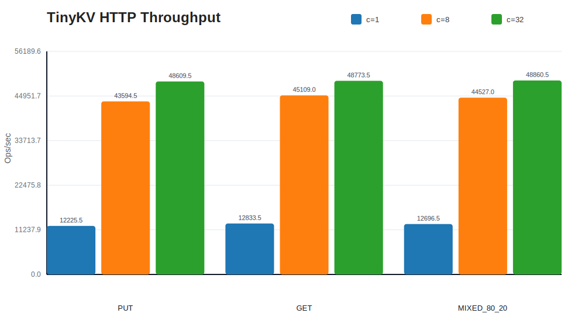
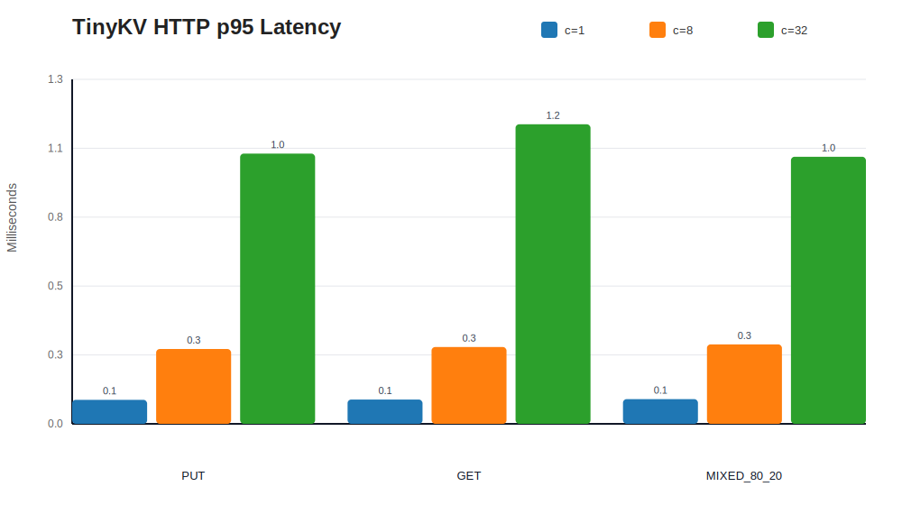
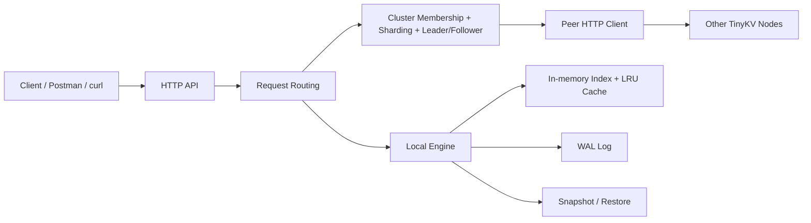

# TinyKV

TinyKV is a Go-based key-value store prototype built step by step from a single-node storage engine toward a distributed KV system.

Current scope:

- durable single-node KV storage
- HTTP API for reads, writes, snapshots, and restore
- static cluster membership, sharding, and leader/follower routing
- benchmark artifacts and charts that can be reproduced locally

## Highlights

- Storage engine: `PUT / GET / DELETE`, WAL recovery, compaction, concurrent access safety, snapshot / restore
- Service layer: HTTP API for KV operations plus cluster inspection endpoints
- Cluster layer: static membership, shard routing, leader/follower abstraction, node-to-node forwarding, best-effort replication
- Performance snapshot: up to `48.3k ops/s` in the current single-node HTTP benchmark with `p95` latency near `1.0-1.1 ms` at concurrency `32`

## Benchmark Snapshot

<p align="center">
  
  
</p>

Quick benchmark takeaways from the current run:

- `PUT`: up to `47,384 ops/s`, `p95 = 1.038 ms`
- `GET`: up to `47,990 ops/s`, `p95 = 1.151 ms`
- `MIXED 80/20`: up to `48,316.5 ops/s`, `p95 = 1.026 ms`

## Architecture



## Implemented

- single-node `PUT / GET / DELETE`
- WAL-based persistence and recovery
- compaction for rewriting live keys
- concurrent access protection in the storage engine
- HTTP API for KV operations
- snapshot / restore support
- static cluster membership
- shard routing abstraction
- leader/follower role abstraction per shard
- node-to-node HTTP forwarding
- best-effort replication to follower replicas
- cluster inspection endpoints

## Not Implemented Yet

- TTL
- dynamic cluster membership
- quorum-based replication
- Raft leader election
- heartbeats
- log replication
- commit index
- crash recovery for distributed replication

## Project Layout

- `engine/`: local storage engine, WAL, index rebuild, cache, compaction, snapshot / restore
- `server/`: HTTP API, cluster-aware routing, forwarding, replication hooks, snapshot endpoints
- `cluster/`: membership, shard routing, replica roles, peer HTTP client
- `cmd/tinykv/`: executable entrypoint
- `cmd/tinykvbench/`: reproducible HTTP benchmark and chart generator

## Quick Start

### Run In Single-Node Mode

```bash
go run ./cmd/tinykv \
  -addr 127.0.0.1:8080 \
  -data ./tinykv.data
```

Example requests:

```bash
curl -i -X PUT --data 'world' http://127.0.0.1:8080/kv/hello
curl -i http://127.0.0.1:8080/kv/hello
curl -i -X DELETE http://127.0.0.1:8080/kv/hello
curl -o backup.snapshot http://127.0.0.1:8080/snapshot
curl -i -X POST --data-binary @backup.snapshot http://127.0.0.1:8080/restore
curl -i http://127.0.0.1:8080/healthz
```

### Run In Static Cluster Mode

All nodes must start with the same:

- `-peers`
- `-shards`
- `-replicas`

Each node must use its own:

- `-addr`
- `-data`
- `-node-id`

Example: two-node cluster with replication factor `2`

Terminal 1:

```bash
go run ./cmd/tinykv \
  -addr 127.0.0.1:8081 \
  -data ./node-a.data \
  -node-id node-a \
  -peers node-a=http://127.0.0.1:8081,node-b=http://127.0.0.1:8082 \
  -shards 8 \
  -replicas 2
```

Terminal 2:

```bash
go run ./cmd/tinykv \
  -addr 127.0.0.1:8082 \
  -data ./node-b.data \
  -node-id node-b \
  -peers node-a=http://127.0.0.1:8081,node-b=http://127.0.0.1:8082 \
  -shards 8 \
  -replicas 2
```

Useful checks:

```bash
curl -i http://127.0.0.1:8081/cluster/membership
curl -i http://127.0.0.1:8081/cluster/route/hello
curl -i -X PUT --data 'world' http://127.0.0.1:8082/kv/hello
curl -i http://127.0.0.1:8081/kv/hello
curl -i http://127.0.0.1:8082/kv/hello
curl -o node-a.snapshot http://127.0.0.1:8081/snapshot
```

## HTTP API

### KV Endpoints

- `PUT /kv/{key}`
  - request body: raw value bytes
  - success: `204 No Content`
- `GET /kv/{key}`
  - success: `200 OK`
  - response body: raw value bytes
- `DELETE /kv/{key}`
  - success: `204 No Content`
- `GET /snapshot`
  - returns a binary snapshot of the current local node state
- `POST /restore`
  - request body: raw snapshot bytes previously created by `GET /snapshot`
  - success: `204 No Content`
- `GET /healthz`
  - success: `200 OK`
  - response body: `ok`

### Cluster Debug Endpoints

- `GET /cluster/membership`
  - returns the local node view of cluster membership, shard count, and replication factor
- `GET /cluster/route/{key}`
  - returns the shard route for a key, including the leader and follower replicas

## Phase 2 Notes

The current Phase 2 layer is intentionally simple:

- shard ownership is deterministic and static
- the first replica in a shard route acts as leader
- follower nodes accept replicated writes from the leader
- client writes sent to non-leader nodes are proxied to the leader
- replication is best-effort and synchronous
- snapshot / restore is currently node-local administration, not a cluster-wide consistent snapshot

This is a useful abstraction layer for a later Raft phase, but it is not a consensus system yet.

## Benchmarking

Benchmark artifacts are generated under `docs/bench/`:

- `docs/bench/results.csv`
- `docs/bench/results.json`
- `docs/bench/throughput.svg`
- `docs/bench/latency-p95.svg`

Re-generate them with:

```bash
go run ./cmd/tinykvbench \
  -duration 2s \
  -concurrency 1,8,32 \
  -value-size 256 \
  -output-dir docs/bench
```

If you only want to redraw the charts from an existing benchmark run:

```bash
go run ./cmd/tinykvbench \
  -render-from docs/bench/results.json \
  -output-dir docs/bench
```

Methodology:

- benchmark target: single-node TinyKV HTTP API
- transport: in-process `httptest` HTTP server and `net/http` client
- value size: `256B`
- preload set: `20,000` keys for read and mixed workloads
- write durability mode: default `SyncOnWrite=false`
- duration per case: `2s`
- concurrency levels: `1`, `8`, `32`
- environment: macOS `15.7.3`, `arm64`, Go `1.26.0`, `8` logical CPUs

### Result Summary

| Workload | Concurrency | Throughput (ops/s) | p50 (ms) | p95 (ms) | p99 (ms) |
| --- | ---: | ---: | ---: | ---: | ---: |
| PUT | 1 | 12,494.0 | 0.078 | 0.092 | 0.144 |
| PUT | 8 | 44,482.5 | 0.169 | 0.287 | 0.410 |
| PUT | 32 | 47,384.0 | 0.623 | 1.038 | 1.888 |
| GET | 1 | 12,589.0 | 0.077 | 0.093 | 0.141 |
| GET | 8 | 44,544.5 | 0.165 | 0.295 | 0.455 |
| GET | 32 | 47,990.0 | 0.622 | 1.151 | 1.891 |
| MIXED 80/20 | 1 | 12,243.0 | 0.078 | 0.095 | 0.155 |
| MIXED 80/20 | 8 | 42,062.0 | 0.169 | 0.305 | 0.518 |
| MIXED 80/20 | 32 | 48,316.5 | 0.624 | 1.026 | 1.816 |

## Testing

```bash
go test ./...
go test -race ./...
```

## Current Limitations

- there is no Raft or quorum logic yet
- replication can become inconsistent if a follower is unavailable during a write
- membership is static and configured at startup
- there is no TTL eviction yet
- restoring a snapshot in cluster mode only replaces the local node state

## Next Steps

1. TTL
2. stronger cluster write guarantees
3. cluster-aware snapshot coordination
4. Phase 3 Raft-based replication
